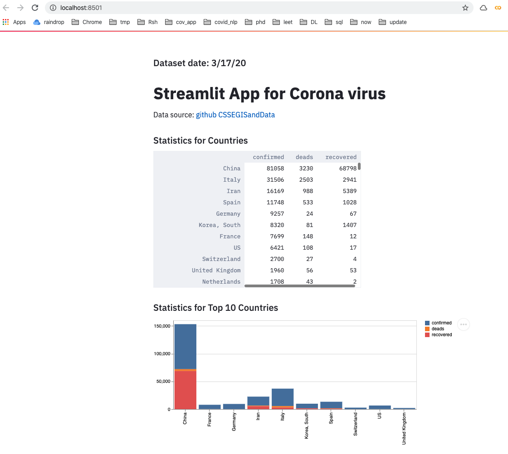

|  Notebook | Rendered   | Description  |  Author |
|---|---|---|---|
| streamlit_app.ipynb  | [ipynb](https://github.com/bhishanpdl/Project_Coronavirus19/blob/master/streamlit_app/streamlit_app.ipynb), [rendered](https://nbviewer.jupyter.org/github/bhishanpdl/Project_Coronavirus19/blob/master/streamlit_app/streamlit_app.ipynb)  |   | [Bhishan Poudel](https://bhishanpdl.github.io/)  |

# To run the app
- Install the python module `streamlit`
- `streamlit run app.py` which will open [http://localhost:8501](http://localhost:8501)

